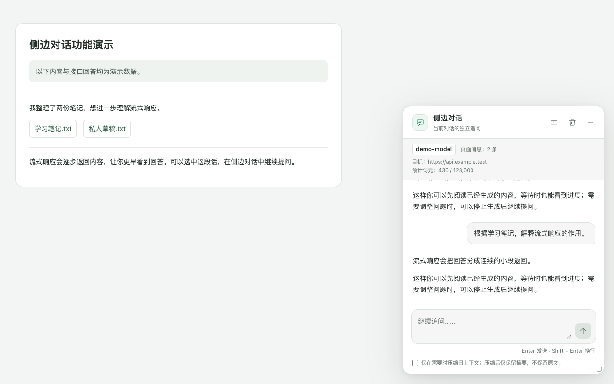
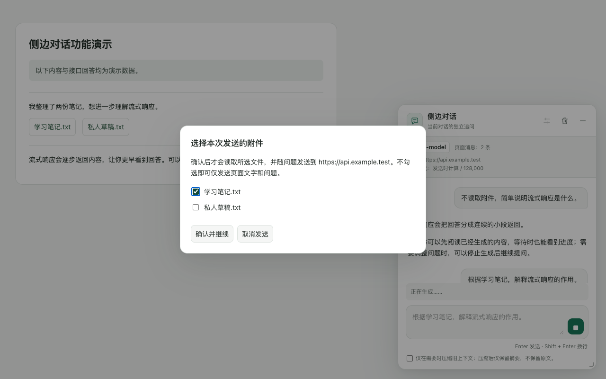

<p align="center">
  
</p>

<h1 align="center">侧边对话助手</h1>

<p align="center">
  <strong>在主对话旁，继续你的追问。</strong><br>
  直接打开浮窗，或选中文字引用提问；为每个 ChatGPT 对话保留独立的侧边记录。
</p>

<p align="center">
  <code>Chrome 扩展</code> · <code>自备模型接口</code> · <code>流式回答</code> · <code>本地记录</code>
</p>

<p align="center">
  <a href="#快速开始">快速开始</a> ·
  <a href="#使用指南">使用指南</a> ·
  <a href="#常见问题">常见问题</a> ·
  <a href="#开发说明">开发说明</a>
</p>

<p align="center">
  <a href="docs/store-assets/store-side-chat-answer.png">
    
  </a>
</p>

<p align="center">
  <sub>实际扩展界面，页面内容、模型地址和回答为合成演示数据；不代表真实 ChatGPT 或模型接口验收。</sub>
</p>

<details>
<summary>查看附件确认界面</summary>



附件只有在你确认后才会读取或下载，也可以不选附件继续。本图同样使用合成演示数据，素材说明见 [商店素材](docs/store-assets/README.md)。

</details>

## 功能亮点

| 功能 | 使用体验 |
| --- | --- |
| **引用追问** | 直接展开收起栏即可提问；展开且未生成回答时，划词会更新引用，也可清除或重新选择。 |
| **自由浮窗** | 浮窗和收起栏均可拖动，浮窗可调整大小；位置与大小保存在本机，刷新后从收起栏重新打开。 |
| **流式阅读** | 支持 Markdown、代码块和数学公式；可停止生成、保留未完成回答，并在可重试错误后重新请求。 |
| **主题跟随** | 浮窗及内嵌设置跟随 ChatGPT 的深色／浅色主题，独立设置页跟随系统主题。 |
| **附件确认** | 发送时附带当前页面可读取的对话；附件逐个确认后才读取和发送，支持文本、可提取文字的 PDF 及兼容模型的图片输入。 |
| **独立记录** | 每个 ChatGPT 对话保存独立的本地侧边历史，可恢复、继续追问或清空。 |
| **上下文管理** | 检查发送预算，超限时提示；可手动启用旧上下文压缩。 |

## 快速开始

> **使用前准备**：需要 Chrome、满足 `^20.19.0 || >=22.12.0` 的 Node.js 和 npm，以及自备的模型接口与 API 密钥。扩展不提供模型额度；问答、连接测试和上下文压缩可能产生服务商费用。

### 1. 构建并加载扩展

在项目根目录运行：

```bash
npm ci
npm run build
```

1. 在 Chrome 地址栏打开 `chrome://extensions/`。
2. 开启 **开发者模式**。
3. 点击 **加载已解压的扩展程序**，选择项目中的 `dist/` 文件夹。
4. 打开或刷新已有的 ChatGPT 对话页面。

### 2. 配置模型

首次安装会打开设置页；也可以点击 Chrome 工具栏中的扩展图标、从扩展的选项页或侧边窗口中的 **设置** 进入。

1. 阅读并同意数据使用说明。
2. 填写下表中的模型配置。
3. 点击 **保存并授权接口访问**，授予所配置接口的访问权限。
4. 点击 **测试连接**。这会发送固定测试提示，不附带 ChatGPT 对话。
5. 首次配置完成后，刷新 ChatGPT 页面，点击 **侧边对话** 或选中文字开始使用。

| 配置项 | 填写说明 |
| --- | --- |
| **Base URL** | 需兼容流式 Chat Completions，形如 `https://provider.example/v1`。不要包含 `/chat/completions` 后缀，扩展会自动追加；示例地址仅说明格式。 |
| **模型** | 填写接口支持的模型 ID。 |
| **上下文窗口** | 填写模型实际支持的词元上限，扩展接受 `1024` 到 `10000000` 之间的整数。 |
| **图片输入** | 仅在所选模型支持图片时勾选。 |
| **API 密钥** | 填写对应接口的密钥；同一 Base URL 下留空可保留已保存的密钥，切换 Base URL 时需填写对应密钥。 |

远程接口必须使用 HTTPS，本机的 `localhost` 和 `127.0.0.1` 可以使用 HTTP。API 密钥保存在本机的扩展存储中，扩展重新加载或 Chrome 重启后仍保留，保存后不回显；可在设置页点击 **忘记已保存的 API 密钥** 移除。

后续在浮窗内修改并保存设置后，点击 **返回对话** 即可刷新当前窗口的模型配置。

## 使用指南

### 提问与引用

1. 点击收起栏 **侧边对话** 展开窗口，无需先选中文字。
2. 直接输入问题，或选中主对话中同一条用户／助手消息的文字，引用会显示在输入框上方。
3. 点击引用右上角的 **×** 可清除当前引用，也可以重新划词替换；输入的草稿会保留。
4. 发送问题；若出现附件清单，逐个勾选需要发送的文件并确认，也可以不选附件继续。确认前不会读取或下载文件内容；无法读取时可重选本地文件或跳过。

回答完成后，本轮引用会从输入区清除，可直接继续追问。清除当前引用不会删除已发送消息中的引用或侧边记录。

### 常用操作

| 操作 | 方式与效果 |
| --- | --- |
| **发送／换行** | <kbd>Enter</kbd> 发送，<kbd>Shift</kbd> + <kbd>Enter</kbd> 换行；也可点击发送按钮。 |
| **移动／缩放** | 拖动标题栏移动浮窗，拖动右下角手柄调整大小；最小化后可拖动收起栏。 |
| **最小化／恢复** | 点击最小化按钮收起，点击收起栏恢复。最小化不会停止生成；收起且未生成回答时，也可划词后点击「在侧栏中提问」展开。 |
| **停止／重试** | 生成时可点击「停止生成」，已收到的部分回答保留并标记为「未完成」；出现可重试错误时可点击「重试」。 |
| **切换主对话** | 停止当前侧边请求，清除未发送草稿与当前引用，并以收起栏载入目标对话的记录。 |
| **清空记录** | 浮窗中清空当前记录，设置页中清空全部侧边记录。 |

> **新对话页**也能显示收起栏、打开窗口和设置。先在 ChatGPT 中发送消息，建立 `/c/<会话 ID>` 对话后，才能发送侧边问题。

## 常见问题

<details>
<summary><strong>页面没有「侧边对话」收起栏</strong></summary>

在设置页同意数据说明并保存配置，再刷新 ChatGPT 页面；重新加载扩展后也需要刷新页面。

</details>

<details>
<summary><strong>新对话页无法发送，或分享页无法使用</strong></summary>

先在 ChatGPT 中建立主对话，确认地址为 `https://chatgpt.com/c/<会话 ID>`；目前不支持 `/share/` 等其他会话路径。

</details>

<details>
<summary><strong>提示无法完整读取对话</strong></summary>

确认主对话消息已加载后刷新重试；若页面结构仍无法识别，扩展会阻止发送，可使用错误区域的「复制诊断信息」辅助排查。

</details>

<details>
<summary><strong>连接失败、身份验证失败或缺少接口权限</strong></summary>

核对 Base URL、模型 ID 和 API 密钥，重新保存并授权，再测试连接；额度或频率限制需在模型服务商处检查。

</details>

<details>
<summary><strong>提示上下文超限</strong></summary>

可勾选「仅在需要时压缩旧上下文」后重新发送，或减少所选附件、清空不再需要的侧边记录；压缩后仍超限时，请求仍会被阻止。具体范围见 [数据与限制](#数据与限制)。

</details>

## 开发说明

### 构建与验证

| 命令 | 用途 |
| --- | --- |
| `npm run build` | 构建扩展到 `dist/` |
| `npm run typecheck` | TypeScript 类型检查 |
| `npm run test:run` | 运行单元测试 |
| `npm test` | 以监听模式运行单元测试 |
| `npm run verify` | 依次执行类型检查、单元测试和构建 |
| `npm run e2e` | 构建测试版本并运行 Chromium 端到端测试 |
| `npm run package` | 构建生产版本并生成 ZIP 安装包 |

修改源码后的更新顺序：**重新构建 → 在扩展管理页刷新扩展 → 刷新 ChatGPT 页面**。

首次运行浏览器测试前，安装 Playwright 使用的 Chromium：

```bash
npx playwright install chromium
npm run e2e
```

> **测试后恢复生产构建**：端到端测试会向 `dist/` 写入专用测试权限。测试结束后，运行 `npm run build` 恢复生产构建，或直接运行 `npm run package` 生成生产安装包。

安装包输出到 `release/side-chat-companion-<版本号>.zip`，版本号取自 `public/manifest.json`。

### 项目结构

```text
src/
├── background/   模型请求、设置、权限与加密历史记录
├── content/      页面读取、附件处理和浮动窗口
├── options/      扩展设置页
└── shared/       类型、消息协议与公共定义
public/          扩展清单、设置页入口、隐私政策页面与图标
scripts/         构建、图标生成和打包脚本
test/            单元测试与页面样例
e2e/             浏览器端到端测试
docs/            隐私说明、商店文案与设计文档
teach/           本地交互教材、源码快照与学习实验
```

想了解项目实现，可用 Chrome 打开 [本地交互教材](teach/index.html)，阅读和实验无需 API 密钥或运行扩展。教材包含独立源码快照，可能滞后于当前实现；打开方式、快照更新和教材检查见 [教材说明](teach/README.md)。

## 数据与限制

### 数据流向

- **打开窗口或划词**：只在本地识别消息、读取选文，不向模型服务商发送对话。
- **发送问题**：当前页面可读取的对话、引文、侧边历史及确认选择的附件会直接发送到你配置的模型服务商。未选择附件的内容不发送，但其名称或页面中的链接仍可能随对话正文发送。
- **测试与压缩**：连接测试发送固定测试提示；主动启用旧上下文压缩后，超限时会向同一接口额外发送压缩请求。服务商按其自身条款处理收到的数据并可能收费。
- **本地保存**：侧边记录使用 AES-GCM 加密后保存在当前浏览器的 IndexedDB 中，不提供跨设备同步。扩展没有开发者后端，也不收集使用统计。
- **停止与清空**：不会撤回已发送的数据，也无法删除服务商已保存的数据。

### 能力边界

| 项目 | 当前范围 |
| --- | --- |
| **页面读取** | 只读取当前页面中可访问的消息，不保证包含尚未加载或被页面隐藏的历史；会话识别限于 `/c/<会话 ID>` 路径。 |
| **附件** | 单个附件最大 **20 MiB**。PDF 仅提取已有文字，不提供扫描件 OCR；图片需要模型支持。 |
| **词元预算** | 本地粗略估算，发送预算为所填上下文窗口的 **90%**，不等于服务商的精确计数或计费结果。 |
| **上下文压缩** | 仅主动勾选且超限时触发，用主对话摘要替代本次请求中的主对话原文，不会删除 ChatGPT 原消息或本地侧边记录。侧边历史和附件不参与压缩，因此不能保证压缩后一定可发送。 |

### 相关文档

| 文档 | 内容 |
| --- | --- |
| [隐私政策](docs/privacy-policy.md) | 数据处理、保存与用户控制方式 |
| [独立隐私政策页面](public/privacy.html) | 可独立托管的 HTML 页面 |
| [商店发布检查表](docs/chrome-web-store-checklist.md) | 发布验收与提交准备 |
| [商店介绍草稿](docs/chrome-web-store-listing.md) | 介绍文案与审核说明 |
| [商店素材](docs/store-assets/README.md) | 演示截图、宣传图及生成说明 |

提交商店前仍需完成真实 Chrome／ChatGPT／模型接口验收、公开 HTTPS 隐私页面、支持联系方式、商店素材与审核配置。

---

<p align="center">
  <sub>本扩展是独立项目，与 OpenAI 无隶属关系，未获其背书。</sub>
</p>
